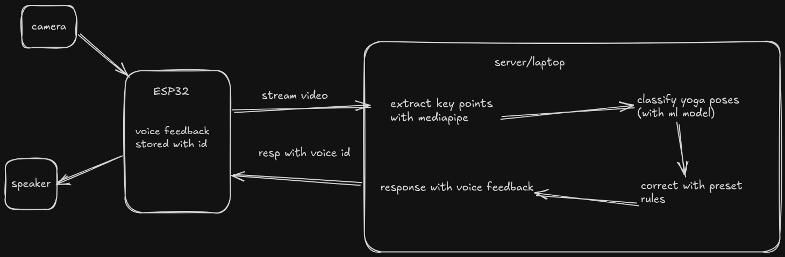

# AI Yoga Assist

Real-time yoga pose classification and correction with bilingual (English/Hindi) voice feedback.

A webcam captures the user, MediaPipe extracts body landmarks on the client, a TensorFlow classifier on the server identifies the pose, and rule-based checkers generate correction cues that are spoken aloud via Piper TTS.



---

## Features

- **10 poses supported** — Tree, Chair, Warrior II, Cobra, Downward Dog, Goddess, Corpse, Bridge, Supine Twist, Happy Baby
- **Bilingual voice feedback** — English and Hindi (press `H` to toggle at runtime)
- **Severity-ranked corrections** — safety issues (red) surface before minor form tips (yellow)
- **Session logging** — per-session JSON logs written to `logs/` with pose duration, correction frequency, and resolution rate
- **Client/server split** — MediaPipe runs on the client; heavy TF inference runs on the server. Works over a local network (e.g. a Raspberry Pi or a separate machine)
- **ESP32 support** — optional firmware in `esp32/` streams JPEG frames to the server directly from a camera module

---

## Architecture

```
┌─────────────────────────────────────┐      HTTP JSON
│  client.py                          │ ─────────────────►  server.py
│                                     │                     server_pipeline.py
│  Webcam → MediaPipe → landmarks[]   │ ◄─────────────────  (TF classifier +
│  FeedbackManager → Piper TTS        │   pose / corrections  corrections)
│  OpenCV window                      │
└─────────────────────────────────────┘
```

`client.py` never loads TensorFlow. `server.py` never touches the camera or audio.

---

## Quick Start (Docker — recommended)

### Prerequisites

- Docker + Docker Compose
- Trained model files in `models/` (see [Training](#training))
- Piper voice files in `models/piper/` (see [Voice Models](#voice-models))
- A webcam at `/dev/video0`
- An X11 display (Linux desktop or `xhost +local:docker` on macOS with XQuartz)

### 1. Allow Docker to use your display

```bash
xhost +local:docker
```

### 2. Start both services

```bash
docker compose up --build
```

The server starts first. The client waits for the server's `/health` endpoint before opening the camera window. Press `ESC` to quit.

### 3. Switch language at runtime

While the client window is focused, press `H` to toggle between English and Hindi voice feedback.

---

## Quick Start (without Docker)

```bash
# Install dependencies
pip install -r server-requirements.txt   # server
pip install -r client-requirements.txt  # client (separate env recommended)

# Download Piper voice models
python download_piper_models.py

# Terminal 1 — start the server
python server.py

# Terminal 2 — start the client
python client.py --server http://localhost:8000 --lang en
```

---

## Project Structure

```
.
├── client.py                  # Entry point: webcam + MediaPipe + voice
├── server.py                  # Entry point: FastAPI inference server
├── server_pipeline.py         # TF classify + corrections (server-side)
├── main.py                    # Local-only runner (data collection / realtime)
├── download_piper_models.py   # Downloads EN + HI Piper ONNX voice files
│
├── src/
│   ├── pipeline.py            # Landmark normalisation + EMA smoothing
│   ├── corrections.py         # Rule-based pose checkers (10 poses, EN + HI)
│   ├── feedback.py            # Priority-queue voice feedback manager
│   ├── session_logger.py      # Per-session JSON logger
│   ├── collect_data.py        # Webcam data collection tool
│   ├── kaggle_to_landmarks.py # Extract landmarks from Kaggle image datasets
│   └── merge_datasets.py      # Merge custom + Kaggle landmark CSVs
│
├── notebooks/
│   ├── pose_classifier.ipynb  # Model training notebook
│   └── outputs/               # Training curve / confusion matrix plots
│
├── models/
│   ├── pose_classifier.h5     # Keras model (not in repo — generate via training)
│   ├── pose_classifier.tflite # TFLite export for Raspberry Pi / ESP32
│   ├── label_encoder.pkl      # Sklearn LabelEncoder
│   └── piper/                 # Piper ONNX voice files (downloaded separately)
│
├── data/
│   ├── poses.csv              # Custom-recorded landmark data
│   ├── kaggle_landmarks.csv   # Landmarks extracted from Kaggle images
│   ├── poses_full.csv         # Merged dataset used for training
│   └── merge.py               # Organises raw Kaggle image folders
│
├── esp32/                     # ESP32-CAM firmware (optional)
├── Dockerfile.server          # Server image
├── Dockerfile.client          # Client image
└── docker-compose.yml         # Starts both services
```

---

## Training

If you want to retrain the classifier:

```bash
# 1. Collect custom data (optional)
python main.py   # choose option 1

# 2. Download and organise Kaggle images into data/image/<pose>/
#    Then extract landmarks:
python src/kaggle_to_landmarks.py

# 3. Merge datasets
python src/merge_datasets.py

# 4. Train
jupyter notebook notebooks/pose_classifier.ipynb
```

The notebook saves `models/pose_classifier.h5`, `models/label_encoder.pkl`, and `models/pose_classifier.tflite`.

---

## Voice Models

Piper ONNX files are not bundled in the repo due to size. Download them with:

```bash
python download_piper_models.py
```

This fetches four files into `models/piper/`:

| File | Language |
|---|---|
| `en_US-lessac-medium.onnx` + `.json` | English |
| `hi_IN-pratham-medium.onnx` + `.json` | Hindi |

---

## Client Options

```
python client.py [--server URL] [--camera N] [--lang en|hi]

  --server   Server base URL (default: http://localhost:8000)
  --camera   Camera device index (default: 0)
  --lang     Voice language: en or hi (default: hi)
```

Press `H` while the window is focused to toggle language at any time.

---

## Supported Poses

| Pose | Key corrections checked |
|---|---|
| Tree (Vrikshasana) | Standing leg angle, raised knee outward, foot height, arms raised, spine lean |
| Chair (Utkatasana) | Knee angle 70–115°, knees not caving, arms overhead, no side lean |
| Warrior II | Front knee 70–115°, back leg straight, arms horizontal, arms spread wide |
| Cobra (Bhujangasana) | Chest lift, shoulders not shrugged, elbows in, shoulders level |
| Downward Dog | Hips high, arms/legs straight, head neutral, shoulders level |
| Goddess (Utkata Konasana) | Knee angle, knees not caving, wide stance, goal-post arms |
| Corpse (Savasana) | Body horizontal, arms away from body, legs apart, head centred |
| Bridge | Hips raised, knees parallel, feet flat |
| Supine Twist | Knee crossed, shoulders flat, arms extended |
| Happy Baby | Knees above hips, knees wide, ankles stacked over knees |

---

## ESP32 (Optional)

Firmware in `esp32/` streams JPEG frames directly to `server.py` via HTTP POST `/process`. Flash `esp32/yoga_assist.ino` with the Arduino IDE, set your WiFi credentials and server IP in the sketch, and the server will process frames from the ESP32-CAM the same way it processes frames from `client.py`.

---

## Session Logs

Every session writes a JSON file to `logs/session_YYYYMMDD_HHMMSS.json` containing:

- Total duration and correction count
- Resolution rate (corrections the user fixed during the session)
- Per-pose time breakdown
- Correction frequency ranking
- Full pose interval timeline

---

## Requirements

| Component | Key dependencies |
|---|---|
| Server | `tensorflow`, `fastapi`, `uvicorn`, `numpy`, `scikit-learn` |
| Client | `mediapipe`, `opencv-python`, `requests`, `piper-tts` |
| Audio | `piper` binary + `aplay` (ALSA) on Linux |

See `server-requirements.txt` and `client-requirements.txt` for pinned versions.
